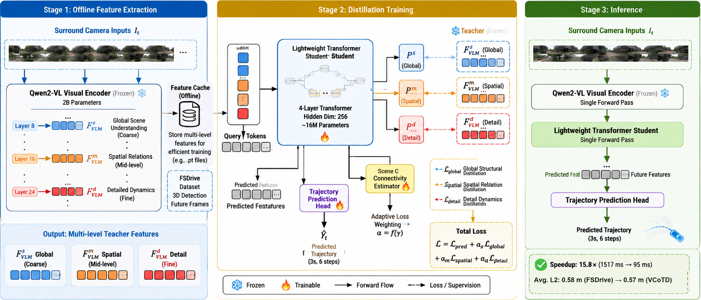
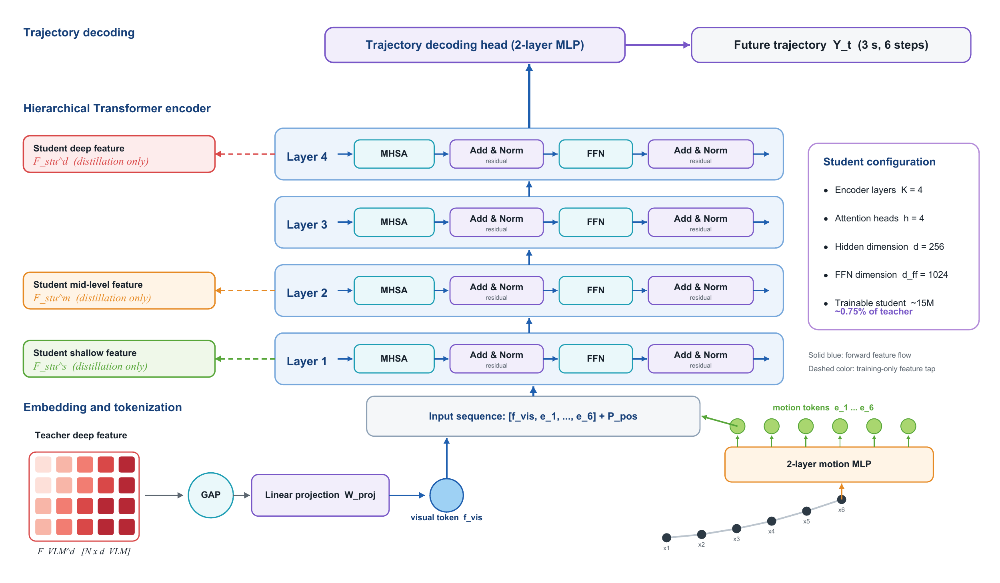
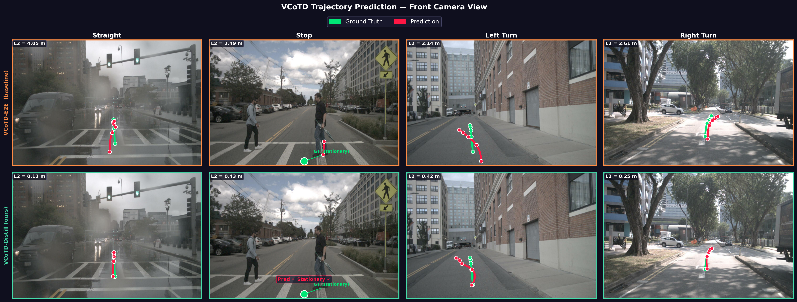

# VCoTD

**Lightweight Visual Chain-of-Thought for Autonomous Driving Planning via Progressive Feature Distillation**

[](https://github.com/flyingbird1993/VCoTD)
[](https://github.com/flyingbird1993/VCoTD)
[](https://www.nuscenes.org/nuscenes)

VCoTD is a lightweight visual chain-of-thought (CoT) planner for end-to-end autonomous driving. Visual CoT can expose explicit future-scene evidence, but pixel-level autoregressive generation is too slow for practical inference. VCoTD keeps the spatial evidence of visual CoT and removes that bottleneck by transferring teacher knowledge in **feature space**.

A frozen Qwen2-VL encoder extracts multi-view visual features. A compact four-layer Transformer then predicts a future-scene representation and decodes **six future waypoints in one parallel forward pass**. The pretrained FSDrive/Qwen2-VL pipeline is used only as a teacher for offline feature distillation; the generative future-image decoder is not used at test time.

<p align="center">
  
</p>
<p align="center"><em>Overall framework: offline teacher-feature extraction, hierarchical distillation training, and encoder + student inference.</em></p>

## Highlights

- **Feature-space visual CoT.** Replace sequential future-image generation with one compact feature-prediction pass, removing the dominant autoregressive bottleneck.
- **Progressive hierarchical distillation.** Align teacher layers 8 / 16 / 24 with student layers 1 / 2 / 4 through global scene descriptors, normalized attention profiles, and deep feature representations.
- **Training-only adaptive weighting.** A sample-dependent score scales distillation strength during training and is removed at inference, so it adds no test-time compute.
- **Planning with much lower latency.** In the submitted Neurocomputing manuscript, VCoTD reports 0.57 m average L2 and 0.19% average collision rate on nuScenes val, with latency reduced from 1517 ms to 95 ms relative to FSDrive.

## Method

VCoTD has three operating stages:

1. **Offline extraction.** The pretrained teacher caches shallow, intermediate, and deep visual features from Qwen2-VL layers 8, 16, and 24.
2. **Distillation training.** The student is trained with trajectory regression plus hierarchical feature alignment. Adaptive weighting changes only the training loss.
3. **Inference.** One frozen visual-encoder pass produces the deep feature; the student predicts all waypoints in a single forward pass. Teacher caches, projection losses, and the complexity gate are not used.

<p align="center">
  
</p>
<p align="center"><em>Student architecture: one pooled visual token and six ego-history tokens are encoded by a four-layer Transformer; layers 1, 2, and 4 provide training-time distillation features.</em></p>

The inference path is:

```text
six surround-view images
  -> frozen Qwen2-VL visual encoder
  -> deep feature sequence
  -> global average pooling + Linear(d_vlm, 256)
  -> concatenate six ego-history tokens
  -> four Transformer encoder layers
  -> two-layer trajectory decoder
  -> six future (x, y) waypoints
```

The training objective combines trajectory loss with three complementary distillation terms:

```text
L_global  : pooled shallow-feature alignment
L_spatial : normalized token-energy profile alignment
L_detail  : interpolated deep-feature alignment

L_distill = 1.0 * L_global + 1.0 * L_spatial + 0.5 * L_detail
alpha_i   = 0.3 + 0.7 * gamma_i
L_total   = mean_i (L_pred_i + alpha_i * L_distill_i)
```

`L_pred` is the masked Euclidean waypoint loss. `gamma` is a learned training-time distillation-strength gate. The inference `predict()` path skips the gate and the distillation feature taps.

### Manuscript-reported nuScenes results

| Method | Avg. L2 (m) | Avg. collision | Latency |
| --- | ---: | ---: | ---: |
| FSDrive teacher | 0.58 | 0.21% | 1517 ms |
| **VCoTD** | **0.57** | **0.19%** | **95 ms** |

These numbers are reported in the submitted manuscript. The complete raw-image pipeline still includes the frozen visual encoder; the trainable student-side module is about 16M parameters.

<p align="center">
  
</p>
<p align="center"><em>Qualitative comparison between a trajectory-only student and full VCoTD distillation on straight, stop, left-turn, and right-turn scenes.</em></p>

## Code Framework

```text
VCoTD
├── model/                          # paper student
│   ├── vcotd_student.py            # hierarchical losses, adaptive gate, checkpoint IO
│   ├── vcotd_student_e2e.py        # trajectory-only / e2e variant
│   └── light_encoder.py
├── create_data/
│   ├── extract_teacher_features.py # cache teacher layers 8 / 16 / 24
│   ├── full_split.json             # train / val token split
│   └── cached_nuscenes_info.pkl    # download separately
├── train_vcotd.py                  # single-GPU / DDP training
├── run_train.sh                    # paper GAP training launcher
├── run_vcotd_ablations.sh          # five paper ablations
├── infer_vcotd.py                  # raw-image inference
├── infer_vcotd_cached.py           # cached-feature diagnostic
├── run_eval_only.py                # mask-aware L2 from a checkpoint
├── vis_vcotd.py                    # trajectory visualization
├── tests_vcotd/                    # unit tests for paper-critical behavior
├── tools/evaluation/               # UniAD / ST-P3 planning metrics
├── LLaMA-Factory/                  # vendored Qwen2-VL / FSDrive runtime
└── MoVQGAN/                        # vendored FSDrive visual-token tools
```

`planning_reasoner/` is an independent research branch and is **not** used for the VCoTD paper commands below.

## Getting Started

### 1. Environment

```bash
git clone https://github.com/flyingbird1993/VCoTD.git
cd VCoTD

conda create -n vcotd python=3.10 -y
conda activate vcotd

# CUDA 12.4
pip install torch==2.5.1 torchvision==0.20.1 torchaudio==2.5.1 --index-url https://download.pytorch.org/whl/cu124

cd LLaMA-Factory
pip install -e ".[metrics,deepspeed,liger-kernel,bitsandbytes]" --no-build-isolation
cd ..
pip install -r requirements.txt
```

### 2. Data and teacher checkpoint

VCoTD needs three external assets that are **not** stored in this repository:

1. **nuScenes** from [nuscenes.org](https://www.nuscenes.org/nuscenes#download). Place or symlink it at `LLaMA-Factory/data/nuscenes`.
2. **Cached nuScenes metadata** `cached_nuscenes_info.pkl` from the [FSDrive release](https://drive.google.com/file/d/1Pc3vKtNHwZVY2mB9xBOOKiMIMr4hJFj7/view?usp=drive_link). Put the pkl in `create_data/` and put the `metrics` folder in `tools/data/`.
3. **Frozen FSDrive / Qwen2-VL checkpoint** at `model/FSDrive_pretrain/`.

```bash
ln -s /path/to/nuscenes LLaMA-Factory/data/nuscenes
```

The included `create_data/full_split.json` lists the train/val tokens used by this codebase.

### 3. Extract teacher features

Run once for each split. This step is offline and writes shallow / middle / deep tensors for distillation.

```bash
python create_data/extract_teacher_features.py \
  --model_path model/FSDrive_pretrain \
  --nuscenes_root LLaMA-Factory/data/nuscenes \
  --split train \
  --output_dir teacher_features \
  --dtype bf16 \
  --resume

python create_data/extract_teacher_features.py \
  --model_path model/FSDrive_pretrain \
  --nuscenes_root LLaMA-Factory/data/nuscenes \
  --split val \
  --output_dir teacher_features \
  --dtype bf16 \
  --resume
```

### 4. Train

Paper-aligned GAP student, single GPU:

```bash
python train_vcotd.py \
  --mode distill \
  --teacher_feat_dir teacher_features \
  --output_dir saves/vcotd_paper_gap \
  --visual_aggregation gap \
  --vis_tokens 1 \
  --epochs 12 \
  --batch_size 64 \
  --lr 1e-4
```

Two GPUs with global batch size 64:

```bash
torchrun --standalone --nproc_per_node=2 train_vcotd.py \
  --mode distill \
  --teacher_feat_dir teacher_features \
  --output_dir saves/vcotd_paper_gap \
  --visual_aggregation gap \
  --vis_tokens 1 \
  --epochs 12 \
  --batch_size 32 \
  --lr 1e-4
```

Optional tmux launcher:

```bash
bash run_train.sh
bash run_train.sh --attach
bash run_train.sh --resume
```

Five paper ablations (`no_distillation`, `global`, `global_spatial`, `hierarchical_fixed`, `full_adaptive`):

```bash
bash run_vcotd_ablations.sh all
```

### 5. Inference

Raw-image path used in the manuscript. It still needs one frozen Qwen2-VL encoder pass, but no autoregressive future-image decoder:

```bash
python infer_vcotd.py \
  --student_ckpt saves/vcotd_paper_gap/checkpoint_best.pt \
  --teacher_model_path model/FSDrive_pretrain \
  --nuscenes_root LLaMA-Factory/data/nuscenes \
  --mode distill \
  --split val \
  --output_path results_vcotd_paper_gap.json
```

Cached-feature diagnostic (not teacher-free deployment):

```bash
python infer_vcotd_cached.py \
  --ckpt saves/vcotd_paper_gap/checkpoint_best.pt \
  --feat_dir teacher_features/val \
  --split val \
  --output_path results_vcotd_cached.json
```

### 6. Evaluation

Fast mask-aware L2 from a checkpoint:

```bash
python run_eval_only.py \
  --checkpoint saves/vcotd_paper_gap/checkpoint_best.pt \
  --teacher_feat_dir teacher_features
```

Official planning metrics after exporting a result JSON:

```bash
python tools/evaluation/evaluation.py \
  --metric stp3 \
  --result_file results_vcotd_paper_gap.json \
  --method VCoTD
```

### 7. Visualization

```bash
python vis_vcotd.py \
  --result_file results_vcotd_paper_gap.json \
  --split val \
  --output vis_vcotd/traj_visualization.png
```

### 8. Tests

```bash
python -m unittest discover -s tests_vcotd -v
```

## What is not included

This repository contains source code only. The following local artifacts are gitignored and must be prepared separately:

- `model/FSDrive_pretrain/` teacher weights
- `teacher_features/` cached teacher features
- `saves/` training checkpoints
- nuScenes images and FSDrive metric caches

## Citation

If you use VCoTD, please cite the submitted paper:

```bibtex
@article{shi2026vcotd,
  title={Lightweight Visual Chain-of-Thought for Autonomous Driving Planning via Progressive Feature Distillation},
  author={Shi, Tengfei and Zhou, Zhe and Mo, Hong and Li, Xiaoli and Wu, Yuxin and Wu, Zhongbo and Wu, Zhao and Li, Xuan and Zhou, Haiying},
  journal={Neurocomputing},
  year={2026},
  note={Under review}
}
```

VCoTD builds on the FSDrive visual-CoT teacher. Please also cite:

```bibtex
@article{zeng2025futuresightdrive,
  title={FutureSightDrive: Thinking Visually with Spatio-Temporal CoT for Autonomous Driving},
  author={Zeng, Shuang and Chang, Xinyuan and Xie, Mengwei and Liu, Xinran and Bai, Yifan and Pan, Zheng and Xu, Mu and Wei, Xing},
  journal={arXiv preprint arXiv:2505.17685},
  year={2025}
}
```

## Acknowledgement

This implementation uses the [FSDrive](https://github.com/MIV-XJTU/FSDrive) teacher stack and vendors [LLaMA-Factory](https://github.com/hiyouga/LLaMA-Factory) and [MoVQGAN](https://github.com/ai-forever/MoVQGAN) for reproducibility. We thank the authors of FSDrive, GPT-Driver, and Agent-Driver for their publicly released resources.
